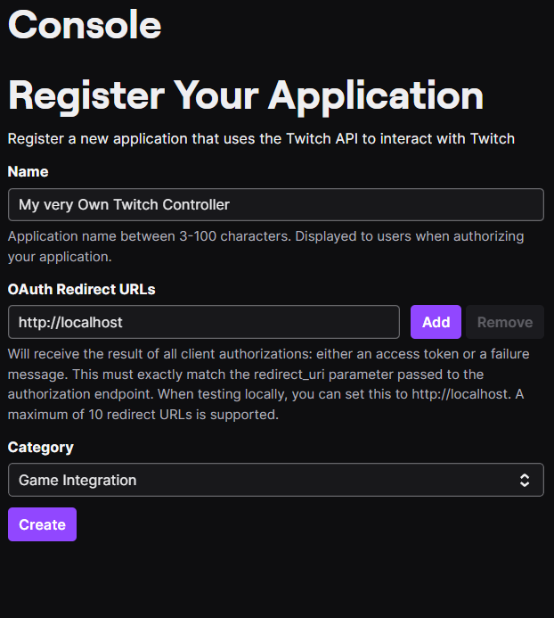
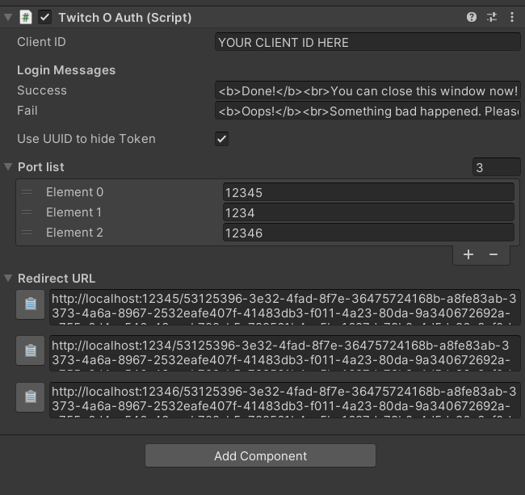
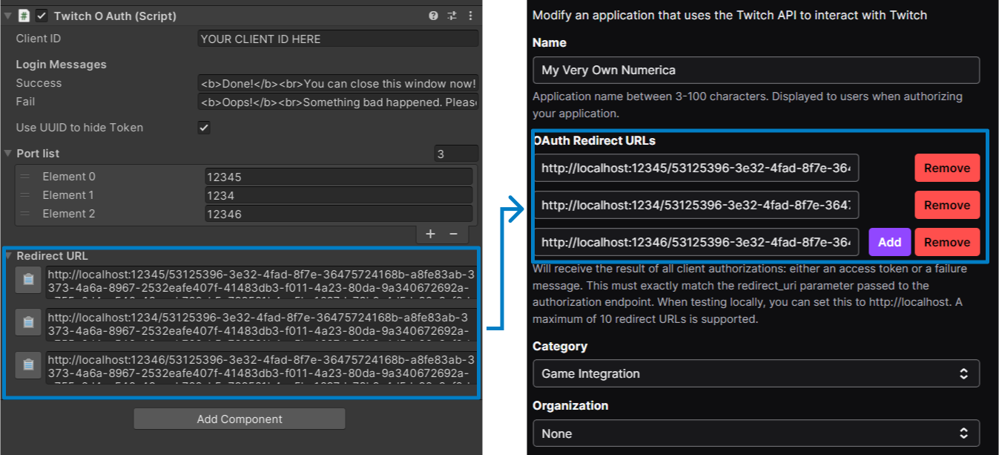
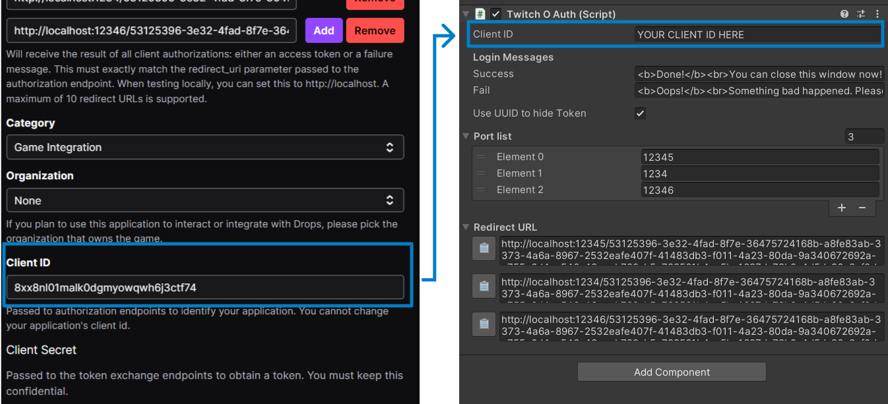

# numerica-twitch

## Game Description
Does your chat know how to count?

Numerica is a mini-game created to be used on Twitch.  The goal is simple: reach the highest possible score.

- Each time a viewer types a number, the counter will increase. 
- If a viewer types the wrong number, the counter will restart, and the viewer gets an optional but well-deserved timeout.
- A viewer can't type two consecutive numbers.

Good luck!

## Download the game
The game is available for free on itch.io ->
[https://rothiotome.itch.io/numerica](https://rothiotome.itch.io/numerica)
- Available platforms
    - Linux
    - Windows
    - Mac comming soon!

## Featuring "Very Simple Twitch Chat" Unity Plugin
This game was entirely developed on [Twitch](https://twitch.tv/RothioTome) as an example of how to use the [Very Simple Twitch Chat Plugin](https://github.com/rothiotome/very-simple-twitch-chat)

## How to setup

In order to run your very own Numerica, you will need to setup a new App in the Twitch developer console and perform the following steps:

1. Go to https://dev.twitch.tv/console/apps and authorize Twitch Developer to access your account.

2. Click on the "Register Your Application" button.

3. Name your application and set the Category to ``Game Integration`` and the OAuth Redirect URL to ``http:/localhost`` for now.

4. Click on "Create".

5. Find your application in the list and Click on "Manage".

6. Open the Unity Project and go to the game scene in the "Scenes" folder. Find a GameObject named "Twitch OAuth" and select it.

7. Copy the Redirect URL addresses from the Twitch OAuth inspector to your Twitch Developer App.

8. Copy the generated "Client ID" from your Twitch Developer App and add it to your TwitchOAuth gameobject

That would be all! Please keep in mind that you'll need to update the OAuth Redirect URLs if you decide to not hide the token using UUID or if you change the ports list.

## FAQ
### I love Numerca, can I contribute to the project?
Sure thing! I'd love to see Numerica grow and become a better game. I am open to receiving Pull Requests with new or improved functionality. However, I want to keep the project simple so I'd advise you to contact me before starting development.

That said, Numerica uses the GPLv3 license, so feel free to fork the project and develop and distribute your own versions of the game. Please keep in mind that any changes must be shared and licensed under the same license.

If you are not a programmer and want to support my work, feel free to make donate me on [itch.io](https://rothiotome.itch.io/numerica), subscribe to my [Twitch channel](https://twitch.tv/RothioTome) or buy me a [ko-fi](https://ko-fi.com/rothiotome).

## Numerica clones with different frameworks and engines
Some cool developers have  created their own versions of numerica. Here is a list featuring them!
- Metalito web version
  - Developed using React, Typescript and TailwindCSS
  - [GitHub](https://github.com/JavierBalonga/numerica-game)
  - [Running version](https://javierbalonga.github.io/numerica-game/)
- Seyacat godot version
  - Developed using Godot
  - [GitHub](https://github.com/seyacat/numerica-twitch-godot)
- Niadecode Kotlin version
  - Developed using Android Jetpack Compose and Kotlin
  - [GitHub](https://github.com/NiadeCode/Numerica)
- DannielTP web version
  - Developed using NextJS
  - [GitHub](https://github.com/DannielTp/numerica-twitch-game)
  - [Running version](https://numerica.dannieltp.com)

## Thanks
This game has been developed thanks to a loving community of people that support me every day on Twitch. This wouldn't be possible without all of you <3

## License
This project is released under the GPLv3 License by RothioTome (2023)