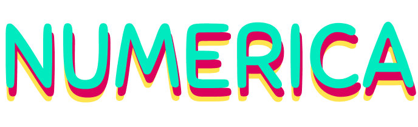
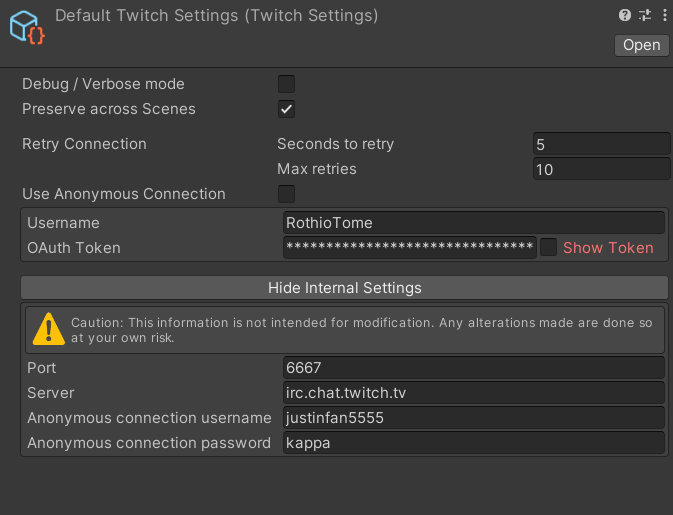
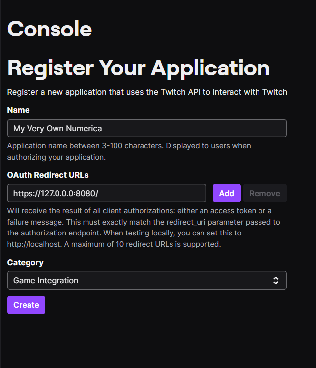

# numerica-twitch

## Game Description
Does your chat know how to count?

Numerica is a mini-game created to be used on Twitch.  The goal is simple: reach the highest possible score.

- Each time a viewer types a number, the counter will increase. 
- If a viewer types the wrong number, the counter will restart, and the viewer gets an optional but well-deserved timeout.
- A viewer can't type two consecutive numbers.

Good luck!

## Download the game
The game is available for free on itch.io ->
[https://rothiotome.itch.io/numerica](https://rothiotome.itch.io/numerica)
- Available platforms
    - Linux
    - Windows

## Featuring "Very Simple Twitch Chat" Unity Plugin
This game was entirely developed on [Twitch](https://twitch.tv/RothioTome) as an example of how to use the [Very Simple Twitch Chat Plugin](https://github.com/rothiotome/very-simple-twitch-chat)

## FAQ
### Secrets.CLIENT_ID and Secrets.CLIENT_SECRET can't be found
When you create a Twitch App on the [Twitch Developer Dashboard](https://dev.twitch.tv/), you get a CLIENT ID (this key is public) and CLIENT SECRET (this key must be private) and need to add them to the header in all your Twitch API Calls.

For obvious reasons, I can't add the original numerica Id and Secret keys to the repository, you need to generate your own ones and add them to the code in order to use the VIP/Timeout functionality.

To generate your own keys:

1.  Go to https://dev.twitch.tv/console/apps and authorize Twitch Developer to access your account.

2.  Click on the "Register Your Application" button.

3. Register your application. Make sure you add the localhost URL to the redirect field

4. Click on the "Manage" button.

5. Click on the "New Secret" button

6. Copy the generated "Client ID" and "Client Secret" and add them to your project :D

### I love Numerca, can I contribute to the project?
Sure thing! I'd love to see Numerica grow and become a better game. I am open to receiving Pull Requests with new or improved functionality. However, I want to keep the project simple so I'd advise you to contact me before starting development.

That said, Numerica uses the GPLv3 license, so feel free to fork the project and develop and distribute your own versions of the game. Please keep in mind that any changes must be shared and licensed under the same license.

If you are not a programmer and want to support my work, feel free to make donate me on [itch.io](https://rothiotome.itch.io/numerica), subscribe to my [Twitch channel](https://twitch.tv/RothioTome) or buy me a [ko-fi](https://ko-fi.com/rothiotome).

## Games based on Numerica
Some cool developers have  created their own versions of numerica. Here is a list featuring them!
- Metalito web version
  - Developed using React, Typescript and TailwindCSS
  - [Github](https://github.com/JavierBalonga/numerica-game)
  - [Running version](https://javierbalonga.github.io/numerica-game/)

## Thanks
This game has been developed thanks to a loving community of people that support me every day on Twitch. This wouldn't be possible without all of you <3

## License
This project is released under the GPLv3 License by RothioTome (2023)